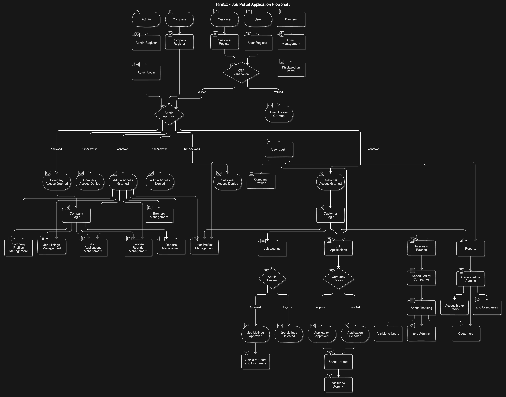
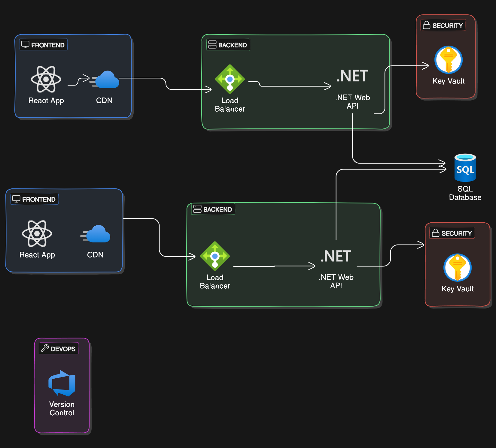

# **Capstone Project**

## **Project Overview**

**Project Title:** HireEz (Job Portal App)

**Description:** The Job Portal App is a web-based application designed to connect job seekers with employers. It allows job seekers to search and apply for jobs while enabling employers to post job listings and manage applications. Administrators oversee the platform to ensure smooth operation and security.

1. **Internal Admin App:** An internal application for administrators to manage users, review applications, and generate reports.
2. **External User and Company App:** A public-facing application where users can search for jobs and apply, and companies can post job listings and manage their profiles.

## **Azure Boards Projects**

### Internal Portal

1. **Internal Backend App** - [View Project](https://dev.azure.com/HireEz/HireEZ-portal-backend)  
   This project is dedicated to the development of the backend for the internal admin application. It includes features for user management, reporting, and data handling.

2. **Internal Frontend App** - [View Project](https://dev.azure.com/HireEz/HireEZ-portal-frontend)  
   This project focuses on the frontend development of the internal admin application. It includes the user interface for user management, application reviews, reporting, and a customizable dashboard.

### External App

3. **External Backend App** - [View Project](https://dev.azure.com/HireEz/HireEZ-app-backend)  
   This project is dedicated to the development of the backend for the external user and company application. It includes features for job listings, user profiles, company profiles, and notification system handling.

4. **External Frontend App** - [View Project](https://dev.azure.com/HireEz/HireEZ-app-frontend)  
   This project focuses on the frontend development of the external user and company application. It includes the user interface for job listings, user profiles, company profiles, and notifications.

By clicking on the links, you will be redirected to the respective Azure Boards projects where you can look at the progress.

## **Project Structure**

### **1. Internal Admin App**

**Project Name:** `JobPortalApp-Admin`

**Description:** This application is designed for internal use by administrators. It includes features for user management, application reviews, and reporting.

#### **Features:**

1. **User Management:**
   - Add, edit, and delete users
   - Assign roles and permissions
2. **Company Management:**
   - Add, edit, and delete companies
   - Assign roles and permissions
3. **Reporting:**
   - Generate reports on applications, users, and system activity
4. **Dashboard:**
   - Overview of system metrics and key performance indicators (KPIs)
   - Total Users, success rate, etc.

### **2. External User and Company App**

**Project Name:** `JobPortalApp-External`

**Description:** This public-facing application is designed for users and companies. Users can search and apply for jobs, and companies can list job postings and manage their profiles.

#### **Features:**

1. **Job Listings:**
   - Search and filter job postings
   - View job details and apply
2. **User Profiles:**
   - Create and manage user profiles
   - Track application status and history
3. **Company Profiles:**
   - Post and manage job listings
   - View applications, manage job postings, and review job applications from users
4. **Notifications:**
   - Email or in-app notifications for job applications, status updates, and new job postings
5. **Application Review:**
   - Companies can review applications submitted by users
   - Users can apply for jobs listed by companies

## **Use Case Scenarios**

### **Job Seeker**

1. Register and log in.
2. Search for jobs using keywords and filters.
3. View job details.
4. Apply for jobs and track application status.
5. Update profile information.

### **Employer**

1. Register and log in.
2. Register a company.
3. Create, update, and delete job listings.
4. View and manage applications for job listings.
5. Update company profile.

### **Admin**

1. Log in.
2. Manage users (view, update, delete).
3. Manage job listings (view, update, delete).
4. Manage companies (view, update, delete).
5. Manage company applications.

## **General Designs**

_Figure: Base Class Diagram illustrating the database design._

_Figure: Base Flow Architecture Diagram illustrating the database design._

## **Development and Deployment**

1. **Frontend (React):**

   - Separate repository for frontend code.
   - Develop UI components for both internal and external applications.

2. **Backend (.NET Web API):**

   - Separate repository for backend code.
   - Implement APIs for managing users, applications, and job listings.

3. **Integration:**

   - Ensure seamless integration between frontend and backend.

4. **Deployment:**
   - Use Azure App Services or similar platforms for deployment.
   - Set up CI/CD pipelines for automated build and deployment processes.

## **Monitoring and Logging**

1. **Logging:**

   - Use Application Insights or similar tools for application logging and monitoring.

2. **Tracking Progress:**

   - Use Azure Boards for tracking tasks, managing sprints, and reviewing progress.

3. **Documentation:**
   - Maintain detailed documentation using Confluence and Swagger.

### Flow Diagram Description:

1. **Azure DevOps (CI/CD Pipeline)**:

   - Build and Push Docker images for Admin API Backend and User API Backend to Azure Container Registry (ACR).
   - Deploy Docker images to Azure Web Apps (Admin API Backend and User API Backend).

2. **Azure Container Registry (ACR)**:

   - Stores Docker images for Admin API Backend and User API Backend.

3. **Azure Web App (Admin API Backend)**:

   - Handles requests from Admin Frontend and interacts with Azure SQL Database and Azure Key Vault.

4. **Azure Web App (User API Backend)**:

   - Handles requests from User Frontend and interacts with Azure SQL Database and Azure Key Vault.

5. **Azure Web App (Admin Frontend)**:

   - Interface for admin functionalities such as user management, job listings management, company management, and application reviews.

6. **Azure Web App (User Frontend)**:

   - Interface for users to search and apply for jobs, manage profiles, and receive notifications.

7. **Azure SQL Database**:

   - Stores data related to users, jobs, companies, applications, and other entities.

8. **Azure Key Vault**:
   - Stores secrets, keys, and configurations securely.

### Flow:

1. **CI/CD Pipeline**:

   - Build -> Push to ACR -> Deploy to Web Apps.

2. **Web Apps**:
   - Admin Frontend -> Admin API Backend -> SQL Database / Key Vault.
   - User Frontend -> User API Backend -> SQL Database / Key Vault.

## **Summary**

This requirements document outlines the structure and features of the Job Portal App, with separate Azure Boards projects for the internal admin app and external user/company app. It provides a clear roadmap for development, including backlog management, sprints, work items, and boards setup. By following this structure, you can efficiently manage and track your project’s progress.
